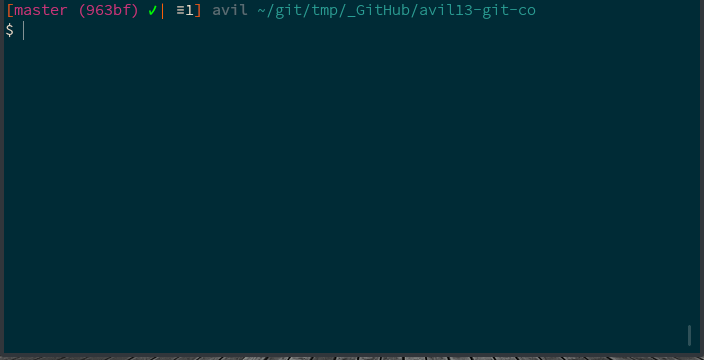

# avil13/co

## Simplest way for use "git checkout"



Install:

```sh
npm install -g avil13-co
```

Type alias "`co`" for switch branch.

# Usage

```sh
# Shows a list of branches that can be switched to
co
```

```sh
# Shows help message
co -h
```

```sh
# Choosing a branch to delete
co -D
```

